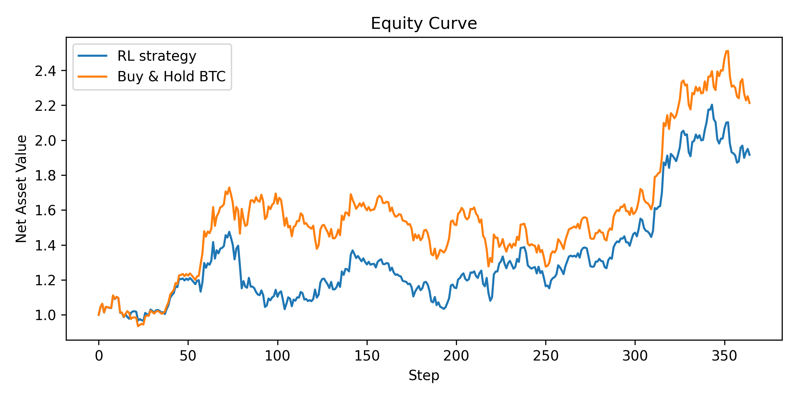

# 🧠 Risk-Aware Deep Reinforcement Learning for Crypto and Equity Trading Under Transaction Costs

**Author:** Ekantheswar Bandarupalli  
**Date:** October 2025  
**Keywords:** Reinforcement Learning, Quantitative Finance, PPO, Risk Management, Financial Machine Learning  

---

## 📘 Project Overview
This project explores how reinforcement learning (RL) can be used to build **risk-aware trading agents** that optimize *capital efficiency* instead of raw profit.  
We implement a **Proximal Policy Optimization (PPO)** agent trained to trade Bitcoin (BTC), Ethereum (ETH), and SPY while accounting for:
- Transaction costs  
- Volatility risk  
- Position-switching penalties  

Unlike typical trading bots, this system focuses on *drawdown control* and *risk-adjusted performance* — mirroring how professional funds balance profitability and exposure.

---

## 🧩 Research Motivation
Traditional RL models in finance often maximize pure returns, ignoring transaction frictions and volatility clustering.  
This project embeds those constraints directly into the RL reward function to answer:

> “Can a reinforcement learning agent learn profitable behavior while explicitly managing trading risk and cost?”

---

## 🧮 Methodology Summary

### RL Framework
- **Algorithm:** Proximal Policy Optimization (PPO)  
- **Library:** Stable-Baselines3  
- **Environment:** Custom Gymnasium trading simulator  
- **Action space:** {-1 (short), 0 (flat), +1 (long)}  
- **Reward function:**
  $$
  r_t = p_t \cdot R_t - c \cdot \mathbf{1}[p_t \neq p_{t-1}] - \lambda R_t^2
  $$  
  where \( c \) is the transaction cost and \( \lambda \) controls risk-aversion.

### Training Configuration
| Parameter | Value |
|------------|--------|
| Data Period | 2020–2024 |
| Train/Test Split | 2020–2023 / 2024 |
| Risk Penalty (λ) | 0.1 |
| Transaction Cost | 5 bps |
| Batch Size | 256 |
| Steps per Update | 2048 |

### Baselines
- **Buy-and-Hold BTC**  
- **Moving-Average Crossover (optional)**  

---

## 📈 Results Summary (Out-of-Sample 2024)

| Strategy | Final NAV | Sharpe | Max Drawdown | Annual Volatility |
|-----------|------------|---------|---------------|-------------------|
| **RL (PPO)** | 1.916 | 1.23 | -30.16% | 44.52% |
| **Buy & Hold BTC** | 2.213 | 1.46 | -26.18% | 44.54% |

### Key Observations
- The **RL agent underperformed** the buy-and-hold baseline in both raw and risk-adjusted terms.  
- Excessive risk penalization led to **conservative trading behavior**, reducing exposure without lowering volatility.  
- This reveals how **reward design choices** directly shape portfolio aggressiveness — a critical insight for financial RL research.

---

## 📊 Visual Results
| Equity Curve | Drawdown Profile |
|---------------|------------------|
|  |  |

---

## 🧠 Research Insights
This experiment highlights a fundamental RL-for-finance trade-off:

> “When risk is over-penalized, exploration collapses.”

It proves that *reward shaping* — not just model complexity — determines whether an RL agent behaves like a speculator or a risk manager.

**Ongoing work** focuses on:
- Adaptive, volatility-sensitive penalties  
- Regime-dependent reward scaling  
- Cross-asset generalization (equities, crypto, commodities)

---

## 📄 Research Paper
📘 **Full Paper (Markdown):** [`paper/paper.md`](paper/paper.md)  
📄 **Publication PDF:** [`paper/paper.pdf`](paper/paper.pdf)

> The paper includes full methodology, results, discussion, and references formatted for SSRN / arXiv submission.

---

## 🧰 Repository Structure
```
deep-rl-trading-rl/
├── data/                     # Raw and processed market data
├── experiments/
│   ├── plots/                # Generated performance figures
│   └── results_test.json     # Evaluation metrics
├── src/
│   ├── env_trading.py        # Custom RL environment
│   ├── train.py              # PPO training script
│   ├── eval.py               # Evaluation logic
│   ├── metrics.py            # Sharpe, drawdown, volatility
│   └── utils.py              # Feature engineering helpers
├── paper/
│   ├── paper.md              # Human-readable paper
│   ├── paper.pdf             # Published paper
│   └── refs.bib              # Bibliography
├── requirements.txt
└── README.md
```

---

## ⚙️ How to Reproduce

### 1️⃣ Install dependencies
```bash
pip install -r requirements.txt
```

### 2️⃣ Run training
```bash
python src/train.py
```

### 3️⃣ Evaluate and visualize
```bash
python src/eval.py
```

---

## 🧮 Tools & Libraries
- Python 3.10+  
- Stable-Baselines3 (PPO)  
- Gymnasium (custom trading environment)  
- Matplotlib, NumPy, Pandas  
- yFinance (data collection)

---

## 🎯 Key Takeaways
- RL trading performance is **driven by reward design**, not just model architecture.  
- Penalizing volatility and turnover changes agent behavior from “profit-seeking” to “risk-aware.” 
- The insights here are directly relevant to **quant research**, **portfolio optimization**, and **financial ML**.

---

## 👨‍🔬 Author Note
This project is part of my **PhD preparation portfolio** focused on combining reinforcement learning and financial modeling.  
The results are intentionally reported as-is to emphasize *research transparency and reproducibility*.  

> “In finance, every failure that is understood is one step closer to robustness.”

---

## 📚 References
- Moody, J. & Saffell, M. (2001). *Reinforcement Learning for Trading*. NIPS.  
- Jiang, Z., Xu, D., & Liang, J. (2017). *Deep Reinforcement Learning for Portfolio Management*. arXiv:1706.10059.  
- Liu, X.-Y. et al. (2021). *FinRL: A Deep Reinforcement Learning Library for Automated Stock Trading*. arXiv:2106.09685.  
- Li, Q. et al. (2019). *Risk-Sensitive Reinforcement Learning for Trading Strategies*. arXiv:1909.09299.  
