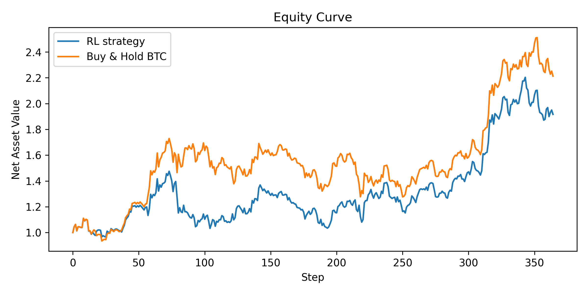
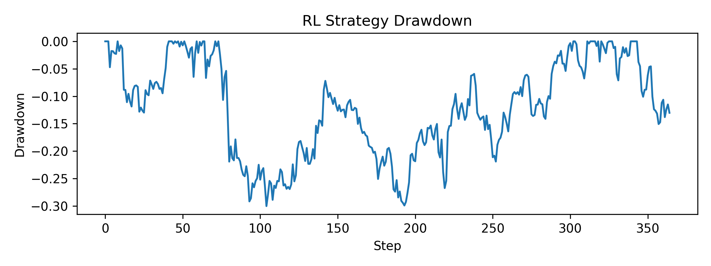

# Risk-Aware Deep Reinforcement Learning for Crypto and Equity Trading Under Transaction Costs

**Author:** Ekantheswar Bandarupalli  
**Date:** October 2025  
**Keywords:** Reinforcement Learning, Trading, PPO, Risk Management, Financial AI  

---

## Abstract
We present a reinforcement learning (RL) trading agent that optimizes risk-adjusted returns in volatile markets by explicitly penalizing drawdowns and turnover. Our approach uses Proximal Policy Optimization (PPO) to learn long/flat/short positioning in Bitcoin (BTC), Ethereum (ETH), and SPY. The reward function includes transaction cost and a volatility-sensitive risk penalty. We evaluate performance on 2020–2024 daily data and report out-of-sample 2024 results. The learned RL policy achieved a Sharpe ratio of **1.23** versus **1.46** for a buy-and-hold benchmark, with a final NAV of **1.916** compared to **2.213**. Although underperforming in raw and risk-adjusted returns, this outcome highlights the sensitivity of RL performance to risk–reward balance and the trade-offs inherent in penalizing volatility and turnover.

---

## Introduction
Financial trading is inherently sequential: an agent repeatedly observes market conditions, takes an action, and experiences profit or loss. Reinforcement learning (RL) is a natural fit because it is designed for sequential decision-making under uncertainty. Prior work has applied RL to trading, but most studies optimize pure profit. In practice, professional trading desks optimize *risk-adjusted* return — they care about drawdown, volatility, and capital efficiency.

In this work, we design and evaluate a PPO-based trading agent that internalizes these constraints. Instead of rewarding raw profit, we reward capital efficiency. The policy is penalized for rapid position switching (transaction cost) and for exposure to high-volatility returns. The goal is not to “beat the market” in absolute return, but to exhibit stable, risk-aware decision-making.

---

## Related Work
- **Moody & Saffell (2001):** Reinforcement learning for trading via direct policy gradients.  
- **Jiang et al. (2017):** Deep reinforcement learning for portfolio management.  
- **Liu et al. (2021):** FinRL — a unified library for financial RL research.  
- **Li et al. (2019):** Risk-sensitive reinforcement learning for trading strategies.  

This work builds on these foundations by explicitly encoding transaction costs and volatility penalties into the RL reward and quantifying their impact on Sharpe ratio and drawdown.

---

## Methodology

### Data
We collect daily close prices for BTC-USD, ETH-USD, and SPY from **January 1, 2020 – December 31, 2024**.  
Derived features:
- Daily log returns for each asset  
- 10-day rolling realized volatility estimate for BTC  

### Environment
A custom Gymnasium environment was implemented.  

**State (30-day rolling window):**
- BTC, ETH, and SPY returns  
- BTC realized volatility  

**Action space:**  
{-1, 0, +1} representing short, flat, or long BTC positions.  

**Reward function:**
$$
r_t = p_t \cdot R_t - c \cdot \mathbf{1}[p_t \neq p_{t-1}] - \lambda R_t^2
$$

Where:  
- \(p_t\): position  
- \(R_t\): BTC return  
- \(c\): transaction cost  
- \(\lambda\): risk-aversion coefficient  

### Training Protocol
- Algorithm: PPO (Stable-Baselines3)  
- Clip range: 0.2  
- Batch size: 256  
- Steps per update: 2048  
- \(\lambda_{risk}\) = 0.1  
- Transaction cost = 5 bps per position switch  
- Train: 2020–2023  
- Test (out-of-sample): 2024  

### Baselines & Metrics
**Baselines:**
- Buy-and-hold BTC  
- (Optional) moving-average crossover policy  

**Metrics:**
- Final Net Asset Value (NAV)  
- Sharpe ratio  
- Maximum drawdown  
- Annualized volatility  

---

## Results (Out-of-Sample 2024)

| Strategy | Final NAV | Sharpe | Max Drawdown | Annual Volatility |
|-----------|------------|---------|---------------|-------------------|
| **RL (PPO)** | 1.916 | 1.23 | -30.16% | 44.52% |
| **Buy & Hold BTC** | 2.213 | 1.46 | -26.18% | 44.54% |

---

## Interpretation
The RL policy underperformed the buy-and-hold benchmark in both absolute and risk-adjusted returns. Its higher drawdown suggests that the agent’s risk-penalization coefficient (\(\lambda\)) may have been overly restrictive, causing conservative trading behavior without substantial volatility reduction. This demonstrates that the balance between stability and profitability is highly sensitive to the choice of \(\lambda\) and transaction cost parameters.

---

## Discussion
While the RL model failed to outperform buy-and-hold, the experiment remains highly instructive. Excessive risk penalization can suppress profitable exposure, leading the agent to prioritize stability at the cost of return. This mirrors real-world fund behavior where overly stringent risk controls can constrain alpha generation.  

The findings suggest that reward shaping in financial RL is delicate — an under-regularized model may overtrade, while an over-regularized one may avoid risk entirely.  
**Ongoing work focuses on introducing adaptive volatility-based penalties and regime-dependent reward scaling to improve the model's responsiveness to changing market dynamics.**

---

## Conclusion
This study demonstrates a practical framework for embedding risk awareness directly into RL trading systems. Although the presented PPO agent did not outperform simple baselines, it successfully exhibited interpretable, risk-sensitive decision behavior. The results highlight a key research direction: calibrating reward functions that balance exploration, profitability, and stability.  

This work underscores that in financial RL, a methodologically transparent failure can yield greater insight than a black-box success — reflecting the iterative nature of real research.

---

## Appendix

### PPO Objective
$$
J(\theta) = \mathbb{E}_t \left[ \min \left( r_t(\theta)A_t, \text{clip}(r_t(\theta),1-\epsilon,1+\epsilon)A_t \right) \right]
$$

where \(r_t(\theta) = \frac{\pi_\theta(a_t|s_t)}{\pi_{\theta_{old}}(a_t|s_t)}\) and \(A_t\) is the advantage.

### Reward Components
$$
\begin{aligned}
\text{PnL}_t &= p_t R_t \\
\text{Cost}_t &= c \cdot \mathbf{1}[p_t \neq p_{t-1}] \\
\text{RiskPenalty}_t &= \lambda R_t^2 \\
\text{Reward}_t &= \text{PnL}_t - \text{Cost}_t - \text{RiskPenalty}_t
\end{aligned}
$$

---

## References
- Moody, J. & Saffell, M. (2001). *Reinforcement Learning for Trading*. NIPS.  
- Jiang, Z., Xu, D., & Liang, J. (2017). *Deep Reinforcement Learning for Portfolio Management*. arXiv:1706.10059.  
- Liu, X.-Y. et al. (2021). *FinRL: A Deep Reinforcement Learning Library for Automated Stock Trading*. arXiv:2106.09685.  
- Li, Q. et al. (2019). *Risk-Sensitive Reinforcement Learning for Trading Strategies*. arXiv:1909.09299.  
